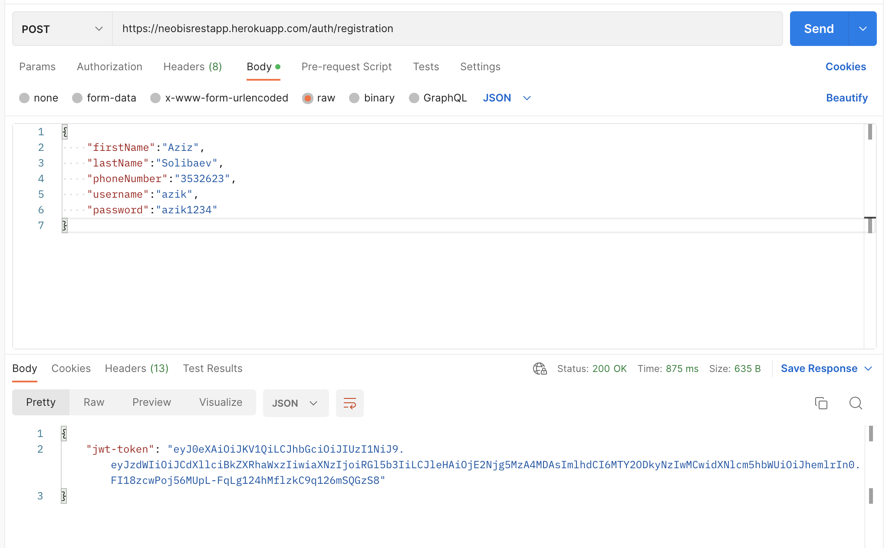
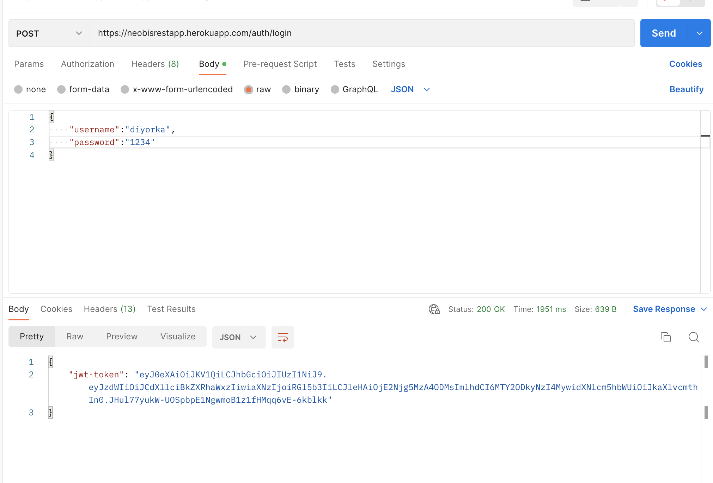
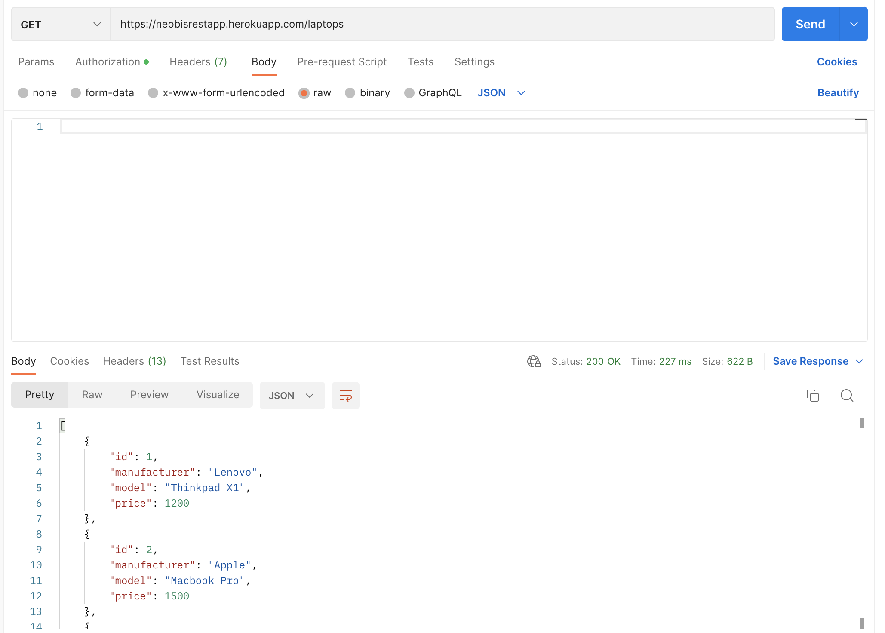
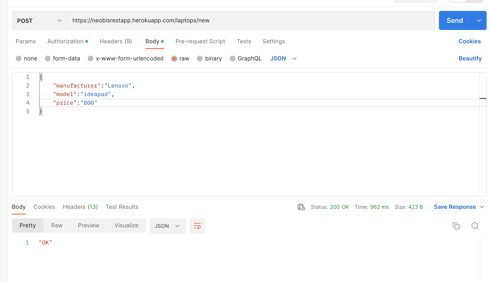
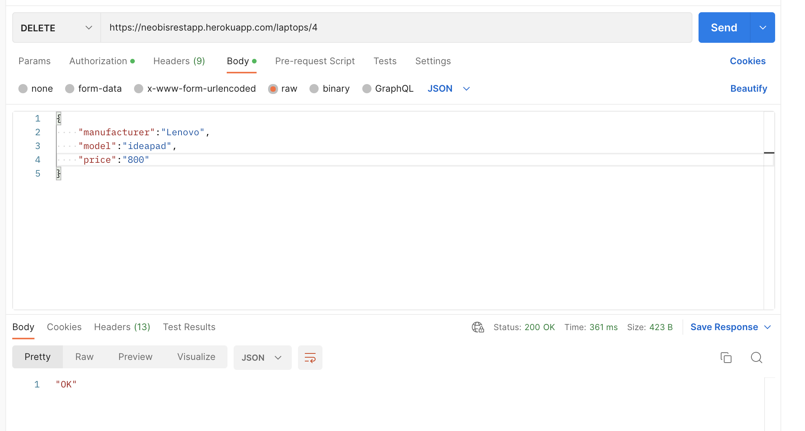

# Heroku link

<ul>
  <li><a href="https://neobisrestapp.herokuapp.com/auth/login">Laptop store</a></li>
</ul>

### Registration and getting jwt token
 
  

### Authorization and getting new JWT Token
 
  

### GET laptops (with jwt token)

  

### Laptop Adding

  

### Laptop Deleting

  
